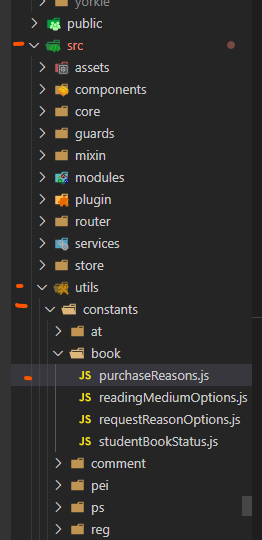

## Constants

In JavaScript, the **Object.freeze()** method _freezes_ an object.  A frozen object can no longer be changed.

```
<!---  examples -->

const numbers = {
    one: 1,
    two: 2,
    three: 3
};

Object.freeze(numbers);

<!-- Or directly assigned -->

const numbers = Object.freeze({
    one: 1,
    two: 2,
    three: 3
});

```

### Pros & Cons

#### Pros

1. Frozen objects also can no longer be changed; preventing new properties frm being added to it, existing properties from being removed,
prevent changing the enumerability, configurability, or writability of existing properties, and prevents the values of existing properties from being changed.

2. Freezing an object also prevents its prototype from being changed.  Freeze method returns the same object that was passed in.

#### Cons

1. Frozen objects with nested properties are not actually frozen.  Child object's properties are mutable if the child object is not frozen as well.

### Our Project Structure

In our main project, constants are stored in the following path _src/utils/constants_.  Each constant structure is placed in its corresponding folder. 



#### Usage

```
 <!--- define and export frozen object in its own file -->

const StudentStatuses = Object.freeze({
  PreRegistro: 'Pre-Registro',
  Registro: 'Registro',
  Evaluado: 'Evaluado',
  Servido: 'Servido',
  NoElegible: 'No Elegible',
  Egreso: 'Egreso',
  Disponible: 'Disponible',
  Inactivo: 'Inactivo',
  Elegible: 'Elegible'
});

export default StudentStatuses;

<!-- import in file where it is going to be used -->

import StudentStatuses from '@/utils/constants/reg/StudentStatuses';
```

### References 

The following references were used in the creation of this documentation:

- JavaScript Constants
[https://developer.mozilla.org/en-US/docs/Web/JavaScript/Reference/Statements/const](https://developer.mozilla.org/en-US/docs/Web/JavaScript/Reference/Statements/const)

- Object Freeze
[https://developer.mozilla.org/en-US/docs/Web/JavaScript/Reference/Global_Objects/Object/freeze](https://developer.mozilla.org/en-US/docs/Web/JavaScript/Reference/Global_Objects/Object/freeze)

