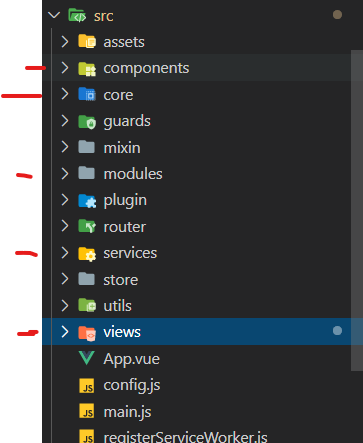
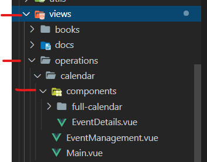
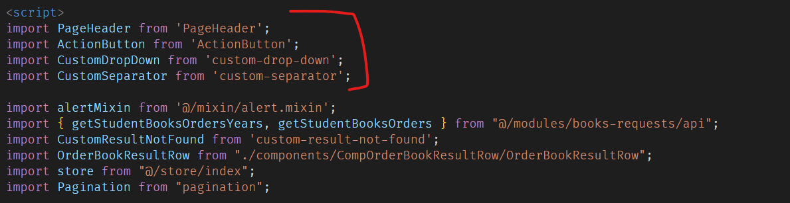

## Simple Structure

In our MiPe project, we used to have a common structure based in vue examples (components, core, view, module/service).

```
<!---  examples -->
```



## Complex Structure

Also, we used a folder organization pattern for shared components in same view or module, which consists of each **view** having its own folder called **component**.

```
<!---  examples -->
```


## Shared Structure
Cuando existe una combinación de componentes compartidos en una estructura compleja se utilizan los componentes del repositorio de verdaccio.

When exist a mix of shared components with complex structure, we have to used verdaccio repository.
```
<!---  examples -->
```


### References

The following references were used in the creation of this documentation:

- Verdaccio Repository
[http://tfstools.cdevteam.com:4873/](http://tfstools.cdevteam.com:4873/)
