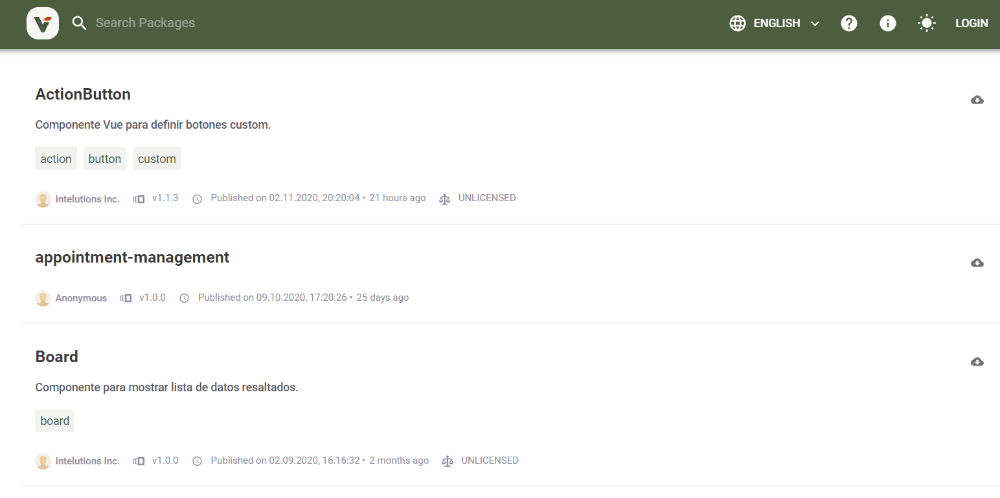

# Verdaccio

Verdaccio is a simple, zero-config-required local private npm registry.  Verdaccio  to use 
all benefits of npm package system in your company without sending all code to the public,
and use your private packages just as easy as public ones.

## Packages

[http://tfstools.cdevteam.com:4873/](http://tfstools.cdevteam.com:4873/)



### Installing
```
> $ npm i <package-name>;
```
### Usage

After package is installed in your project, just need to import it as if it was a local component.
```
> import ActionButton from 'ActionButton';
```

## Project

### Getting Started

* **Clone**

```
> import ActionButton from 'ActionButton';
```

* **npm install**

```
> npm install;
```

* **Run**

After packages have been installed you can run project locally

```
> npm run storybook;
```

When project runs, a **Storybook** page is opened where you can test UI components.
